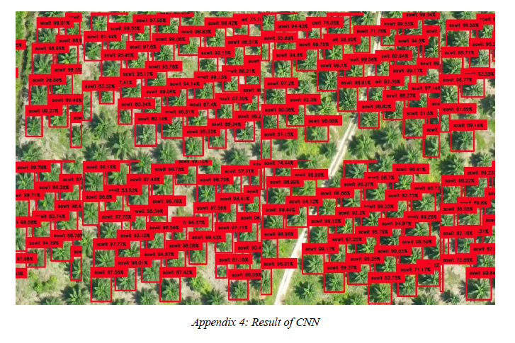
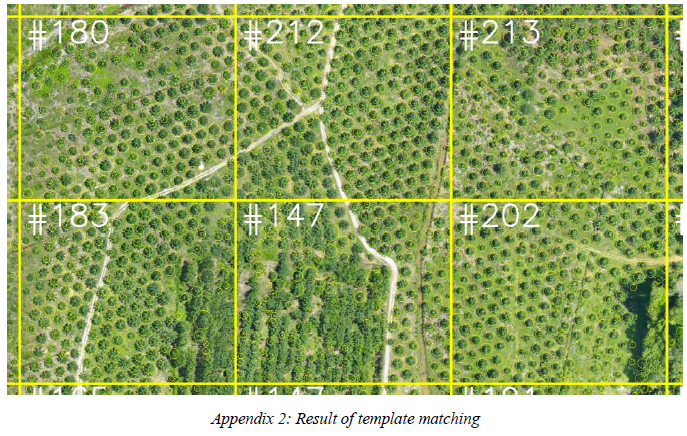
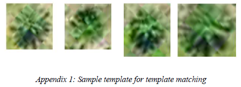

# Palm-Tree-Counter (AI - python backend) (Jupyter-Notebook Program)

UAV - Unmanned Aerial Vehicle or commonly known as Drones are supplying high quality images from its altitude in which is useful data for remapping. 
But there are more ways to benfit the images.  This project uses artifical Intelligence running on python to count the total number of palm trees in a plantations from the 
ready images huge reoltuions of above 50000px x 1600000px that was produced using a image binder software.  These images are analyze by batch slices to reduce the RAM Requirements
# Constraints & Challenges
128 GB RAM is easily overloaded with these huge images. 
even using the 1080Ti 11 GB GPU it is still too heavy for processing.
The image is sliced into managable sizes to batch process using multi threas to use the CPU and GPU more efficiently.

# Screenshots of program results

